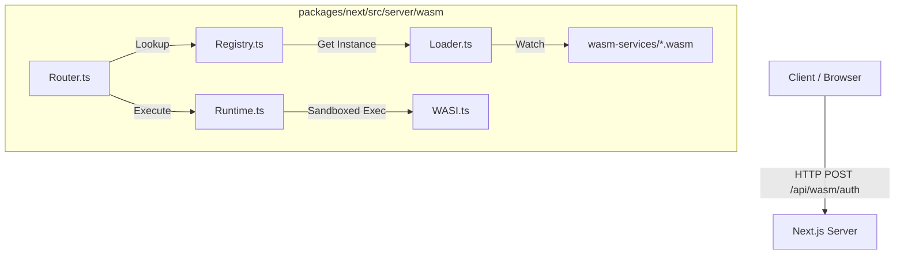

# RFC 0000: NextWasmRuntime - First-Class Experimental WASM Backend

- **Start Date**: 2026-02-06
- **Status**: Experimental / In-Review
- **Author**: Next.js & Systems Architecture Team

---

## 1. Summary

This RFC proposes the introduction of `NextWasmRuntime`, a new internal subsystem in Next.js that enables **first-class, experimentation-ready WebAssembly (WASM) backend services**. 

Validating the "Microservices in a Monolith" pattern, this system allows developers to drop `.wasm` binaries (compiled from Rust, Go, Zig, etc.) into a dedicated project directory, where Next.js will automatically:
1.  **Discover** and load modules.
2.  **Route** HTTP traffic to them.
3.  **Execute** them in a secure, sandboxed WASI environment.
4.  **Manage** their lifecycle similar to Spring Boot services.

## 2. Motivation

Current WASM usage in Next.js requires significant boilerplate. By treating WASM modules as "Backend Microservices":

-   **Polyglot Backend**: Enable high-performance backend logic in languages like Rust or Zig.
-   **Security & Isolation**: Leverage WASM's sandbox for running untrusted code.
-   **Portability**: Prepare for a cross-runtime future (Node.js, Edge, Client).

## 3. Conceptual Architecture

We introduce `packages/next/src/server/wasm` responsible for the WASM service lifecycle.

### 3.1. Internal Substructure
| File | Responsibility |
| :--- | :--- |
| `runtime.ts` | The core execution engine (WASI-compliant). |
| `wasi.ts` | WASI Preview 1 bindings and permissions. |
| `loader.ts` | Module discovery & hot-reloading from `wasm-services/`. |
| `registry.ts` | Spring-style Service Registry. |
| `router.ts` | HTTP ↔ WASM dynamic mapping. |
| `config.ts` | Auto-configuration and capability injection. |

### 3.1.1. Architecture Diagram



## 4. Developer Experience (Spring Boot–style)

### 4.1. Enabling the Feature
Add this to your `next.config.js`:
```javascript
module.exports = {
  experimental: {
    wasmBackend: true,
  },
}
```

### 4.2. Convention-over-Configuration
The user provides a standard directory:
```text
my-next-app/
├── wasm-services/
│   ├── auth.wasm        --> /api/wasm/auth
│   └── math.wasm        --> /api/wasm/math
```

## 5. Automation Pipeline

### 5.1. Build Automation
Next.js watches `wasm-services/` for changes. On update, the `Registry` invalidates the cached module and recompiles the WASM in-memory for instant Hot Reload.

### 5.2. Unified I/O Contract
We standardize on **JSON-over-STDIN/STDOUT** for maximum language compatibility.
-   **Input**: JSON string fed to `stdin`.
-   **Output**: JSON string read from `stdout`.

## 6. Security & Sandboxing
By default, services have **Zero Trust** access to:
-   Network (Denied)
-   Filesystem (Denied)
-   Environment Variables (Whitelisted Only)

Explicit opt-in is provided via `[service].meta.json`.

## 7. Rollout Plan
1. **Phase 1 (Experimental)**: Node.js runtime support.
2. **Phase 2 (Edge)**: Integration with Edge Runtime.
3. **Phase 3 (GA)**: Stabilized API and built-in toolchains.

---
**RFC Author**: Next.js Core Contributor / Systems Architect
